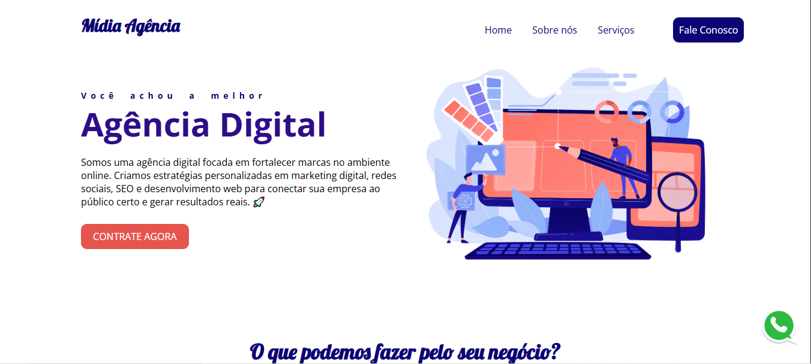

# Mídia Agência - Um projeto de site de agência digital

## Descrição do Projeto

O projeto Mídia Agência foi desenvolvido por mim durante as aulas do curso de CSS do Prof. Dimitri Teixeira com o objetivo simular a página principal de uma agência digital de marketing e desenvolvimento de aplicações web/mobile.

Para a criação do template, foram utilizadas diversas propriedades e funcionalidades do CSS e HTML para garantir um visual agradável e acessível.

Como por exemplo, a característica responsiva do projeto, que permite que ele seja bem utilizado em qualquer proporção de tela (notebook, celular, tablet e etc.). Além disso, seu visual não é somente estático, mas também reage à interação do usuário, o que possibilita maior compreensão de suas ações durante a navegação pelo template.

## Como acessar

Para acessar o site clique no link abaixo:
<a href = "https://wendersd.github.io/Projeto-Site-MidiaAgencia/">Mídia Agência</a>
